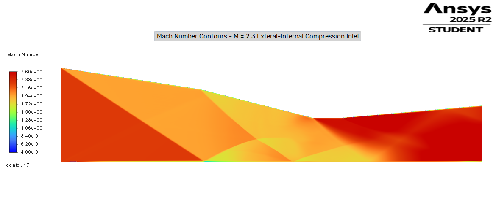
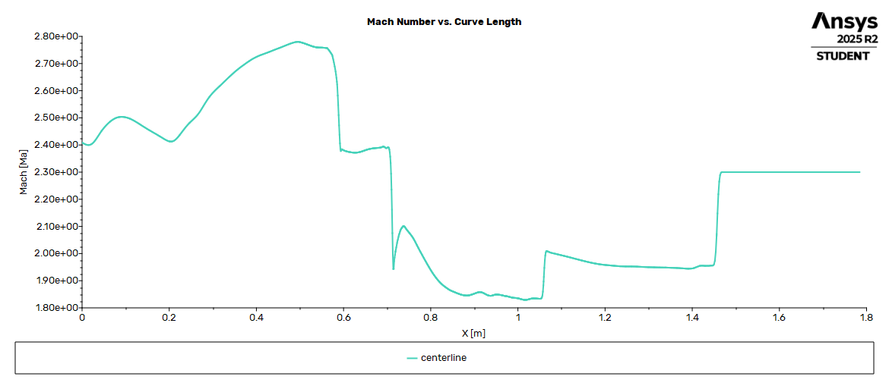
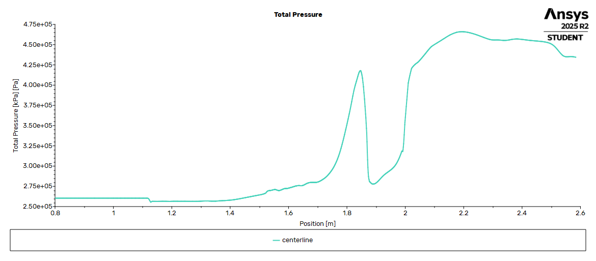

# Integrated Supersonic Inlet and Diffuser Design for a Mach 2.3 Fighter-Class Aircraft

**January 2026**

---

## Project Objective

The project focused on designing and validating a two-dimensional external–internal compression inlet for a fighter-class vehicle operating at **Mach 2.3** and an altitude of **11 km**. The inlet geometry was designed using classical oblique shock theory to achieve staged compression, followed by internal compression into a subsonic throat.

Shock calculations were performed in **MATLAB** to determine ramp deflection angles and expected shock behavior. The geometry was then modeled in **Fusion 360** and analyzed using **ANSYS Fluent** to evaluate flow physics, shock structure, and inlet performance.

A density-based compressible solver was used to determine shock-dominated flow behavior. Turbulence was modeled using the **SST k–ω model**, and total pressure recovery was computed. These results were validated against analytical oblique shock predictions.

Inlet performance was quantified primarily through **total pressure recovery at an internal engine-face cross-section**.

---

## Tools Used

- **MATLAB** (compressible flow and shock calculations)
- **Fusion 360** (2D inlet geometry)
- **ANSYS Fluent** (CFD validation)

---

## Analytical Design and Theory

Shock angle and post-shock properties were computed using oblique shock relations and solved numerically in MATLAB using root-finding methods. These calculations were used to determine ramp deflection angles, oblique shock angles, and expected post-shock flow behavior.

[MATLAB Code Screenshot](docs/images/Screenshot_2026-01-27_203239.png)

## Table 1. Analytical Derived Inlet Performance Metrics at Mach 2.3

| Quantity | Value |
|--------|-------|
| Freestream Mach | 2.30 |
| Ramp 1 Deflection Angle | 8.8° |
| Ramp 1 Shock Angle | 33.17° |
| Ramp 2 Deflection Angle | 14.3° |
| Ramp 2 Shock Angle | 35.54° |
| Total Pressure Recovery (Idealized) | 0.8147 |

---

## CAD – Inlet Geometry

The 2D inlet profile geometry was defined directly from oblique shock analysis. Ramp angles and throat location were selected to achieve controlled compression prior to the terminal normal shock.

[CAD 2D Screenshot](docs/images/Cad_2D_screenshot.png)

---

## CFD – Flow Validation and Visualization

- Density-based solution, compressible flow
- Boundary conditions:
  - **Inlet:** Pressure far-field
  - **Outlet:** Pressure outlet

Total pressure recovery was evaluated using a mass-weighted average on an internal engine-face plane located downstream of the internal shock system to avoid outlet boundary contamination.

---

## Figures

### Figure 1


*Mach number contour at Mach 2.3, showing staged external compression via oblique shocks followed by internal compression into a subsonic throat.*

### Figure 2


*Centerline Mach number distribution along the inlet length, showing staged deceleration from freestream Mach number through external and internal compression.*

### Figure 3


*Mass-weighted total pressure evaluated at an internal engine-face cross-section downstream of the shock system.*

---

## Table 2. Comparison of Analytical and CFD-Predicted Performance Metrics at Mach 2.3

| Quantity | Calculated Value | Simulated Value |
|--------|-----------------|----------------|
| Freestream Total Pressure | – | 283 kPa |
| Engine-Face Total Pressure | – | 256 kPa |
| Total Pressure Recovery | 0.8147 | 0.90 |
| Ramp 1 Shock Angle | 33.17° | 33.7° |

---

## Results and Validation

The inlet performance simulated by compressible CFD showed strong agreement with analytical fluid dynamics calculations. The simulated total pressure recovery was **0.90**, compared to the theoretical value of **0.8147**. The higher recovery observed in the CFD results can be attributed to idealized simulation conditions and the absence of real-world effects such as surface roughness.

The measured shock angle of the first compression ramp from the CFD Mach contour was approximately **33.7°**, closely matching the theoretical value of **33.17°**. This represents less than a 1% error, validating both the inlet geometry and the accuracy of the oblique shock modeling.

Overall, the results demonstrate effective staged compression and acceptable total pressure recovery when operating at Mach 2.3.

---

## Off-Design Analysis

To evaluate robustness outside the design point, the inlet was assessed at additional freestream Mach numbers.

## Table 3. Off-Design Total Pressure Recovery

| Freestream Mach | Total Pressure Recovery |
|---:|---:|
| 2.0 | 0.89 |
| 2.3 | 0.90 |
| 2.6 | 0.93 |

### Off-Design Comparison Figure


*Centerline Mach number comparison across off-design conditions (M = 2.0, 2.3, 2.6), showing the shock-system shift and maintained inlet compression behavior.*

---

## Design Takeaway

This project highlighted the importance of evaluating performance metrics at physically meaningful locations. Early attempts to quantify data at incorrect locations led to misleading results, emphasizing the necessity of using an **engine-face-based measurement plane** for accurate supersonic inlet analysis.

---

## Repository Structure

```text
.
├─ README.md
├─ Project_Summary.pdf
├─ Results/
│  ├─ MachContourIntake.png
│  ├─ Centerline_Mach_vs_X.png
│  ├─ Centerline_Total_Pressure_vs_X.png
│  └─ OffDesign_Centerline_Mach_Comparison.png
├─ docs/
│  └─ images/
│     ├─ Screenshot_2026-01-27_203239.png
│     └─ Cad_2D_screenshot.png
├─ matlab/
│  └─ shock_calculations.m
├─ cad/
│  └─ inlet_geometry.f3d
└─ cfd/
   ├─ case/
   └─ postprocessing/ 
